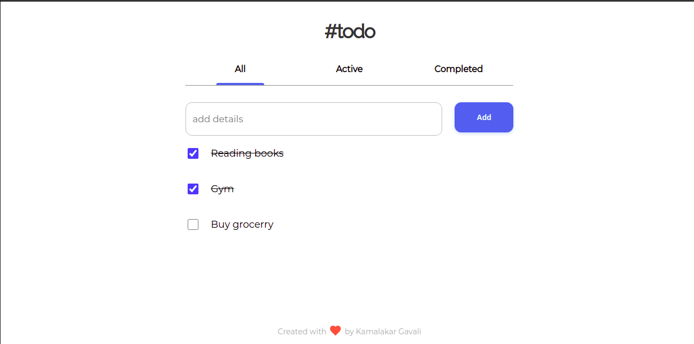

<!-- Please update value in the {}  -->

<h1 align="center">Windbnb</h1>

  <h3>
    <a href="https://pedantic-boyd-abd421.netlify.app/">
      Demo
    </a>
  
  </h3>

<!-- TABLE OF CONTENTS -->

## Table of Contents

- [Overview](#overview)
  - [Built With](#built-with)
- [Features](#features)
- [Contact](#contact)

<!-- OVERVIEW -->

## Overview

<!-- Introduce your projects by taking a screenshot or a gif. Try to tell visitors a story about your project by answering:

- Where can I see your demo?
- What was your experience?
- What have you learned/improved?
- Your wisdom? :) -->

### Built With

<!-- This section should list any major frameworks that you built your project using. Here are a few examples.-->

- [React](https://reactjs.org/)
- [styled-components](https://styled-components.com/)
- [Material Icons](https://mui.com/components/material-icons/)

## Features

- Responsive
- Add task
- Delete task
- delete all task
- Categorization according to active or completed status
- Persistent data Storage

## Contact
- LinkedIn [Kamalakar Gavali](https://in.linkedin.com/in/kamalakar-gavali)
- Twitter [@kamalakar_g1](https://twitter.com/kamalakar_g1)